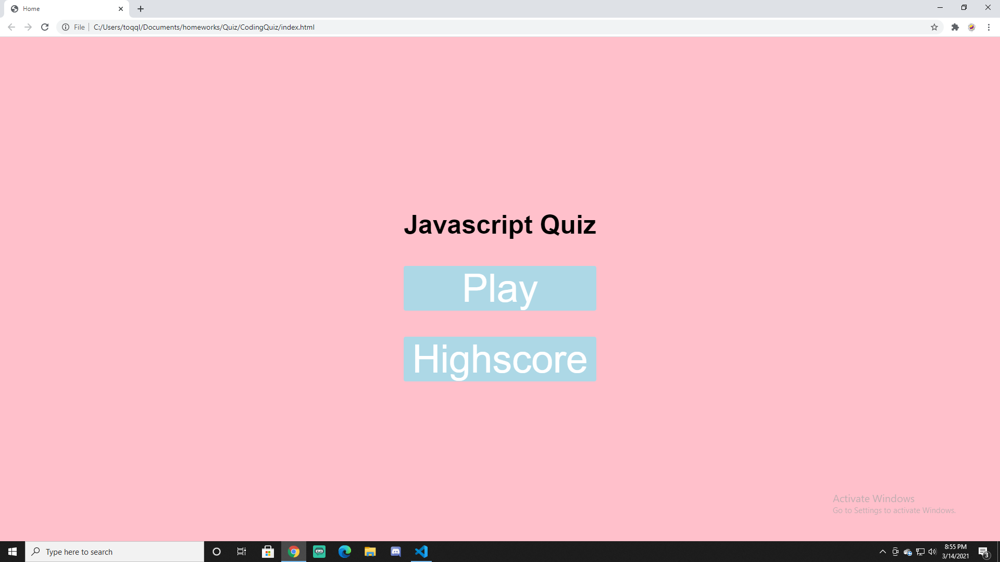
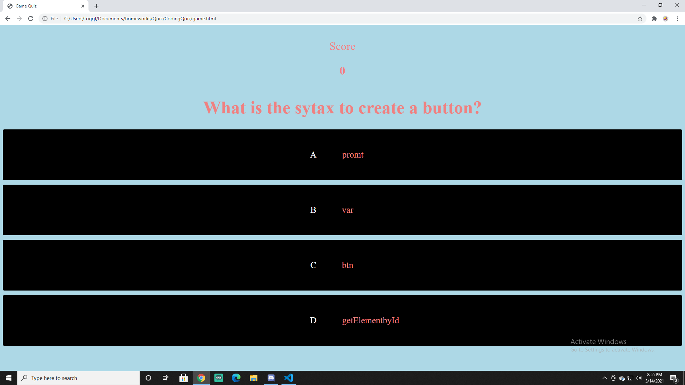
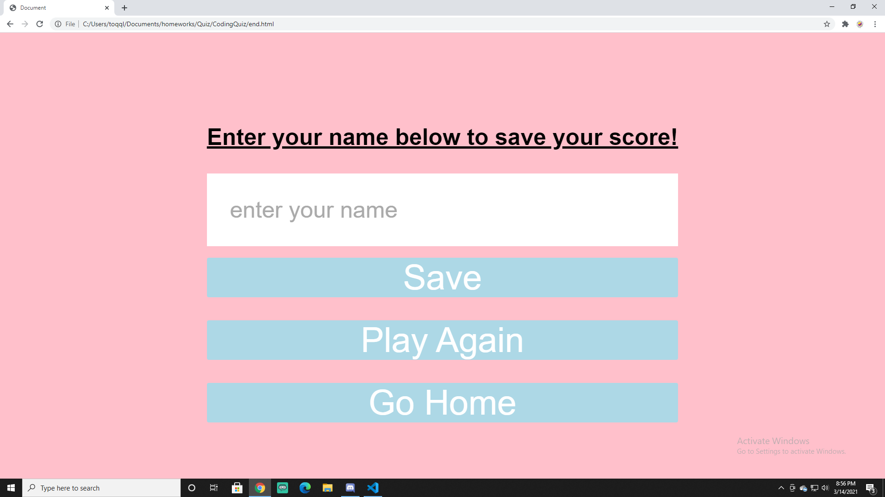

# CodingQuiz

# This client wanted a quiz that involved questoins about coding

# To start we created a webpage and layout to continue through the quiz as the user answered questions

# When the answer is correct, the user is granted 100+ points

# When the user completes the quiz, they can submit their highscore for later

# link to my page!

https://zgibbs97.github.io/CodingQuiz/